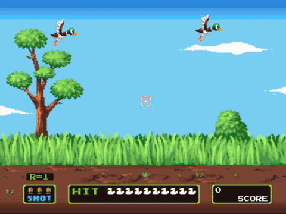
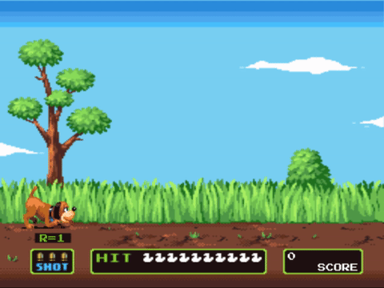

# Ducks Hunter


[Ducks Hunter](http://www.eugenelow.me/DucksHunter/)

Ducks Hunter is a clone of the classic game Duck Hunt by Nintendo. It was created using JavaScript with Canvas using the EaselJS library.



## Features and implementation

### Rendering of the game

To render the game, each portion of the game is layered on top of each other using EaselJS container object. They are a nestable display list.

The most bottom layer is the background which are the trees, sky and the clouds. The second layer are the ducks. This allows the ducks to fly on top the trees, the clouds and the bushes.

However, when ducks fall, they need to be behind the grass and the "ground." Therefore the next container is the grass and the round information.

The same applies for round information, the bullets, the mini ducks and the score. That is the last layer on the canvas.

### Event Listeners

There are only two click event listeners necessary.

The first click listener is on the whole canvas itself. When triggered, it will check the bullet count to see if a bullet can be fired. If so, it will trigger a flash and a gun shot sound, at the same time reducing the bullet count. At this time, the sprites for the bullets will also have to update to show the new bullet count.

```JavaScript
handleShot(e) {
  if (this.bullets > 0) {
    this.shotSound();
    this.bullets -= 1;

    switch (this.bullets) {
      case 2:
        this.bulletsSprite.gotoAndPlay('two');
        break;
      case 1:
        this.bulletsSprite.gotoAndPlay('one');
        break;
      case 0:
        this.bulletsSprite.gotoAndPlay('zero');
        if(this.duckCount > 0) {
          this.ducksFlyAway();
        }
        break;
    }
  }
}
```

The second click listener is on the duck itself. When triggered, it will check if the duck is still alive and if there are any bullets available. If so, the duck will be updated to be dead. Score will be rendered where the duck was killed and have the total updated.

```JavaScript
shotDuck(e) {
  const duck = this.ducks[e.target.duckId];

  if (duck.duck.status === 1 && this.bullets > 0) {
    this.board.miniDuckRed(this.duckCount);
    this.duckCount -= 1;
    duck.deadDuck();
    this.showScoreOnKill(e.target.x, e.target.y);
    this.board.addToScoreBoard();
  }
}
```
Since the ducks are on top of the canvas, its click listener will trigger first so it will not conflict with the reduction of bullets.

### Animations

Although using the Ticker provided by the EaselJS library to update the board on every tick, the actual positions of the canvas elements still have to be updated for them to move. Using `setInterval`, each moving object will have their x, y coordinates update every `x` seconds.



The most difficult part was rendering the dog introduction due to the fact that you have to stop a particular position, sniff, continue walking, sniff and then jump behind the grass.

For each interval, I checked for the dog's position and animation before continuing the animation.

```JavaScript
if (dog.currentAnimation === 'walking' ) {
  dog.x += 8;
}

if (dog.currentAnimation === 'jumping' && dog.y > 210) {
  dog.y -= 13;
}

if (dog.currentAnimation === 'jumping' && dog.y < 240) {
  dog.gotoAndPlay('landing');
  round.shiftToBackground(round.introDogContainer);
}

if (dog.currentAnimation === 'landing') {
  dog.y += 13;
}
```

## Future Directions for the Project

#### Implement different ducks with different flight patterns

I want to have different ducks that fly in less predictable ways to increase the difficulty.

#### Options for one duck and clay shooting

To create more replay value and to provide the gamer more variety, I would like to add the options for one duck at a time and clay shooting.
