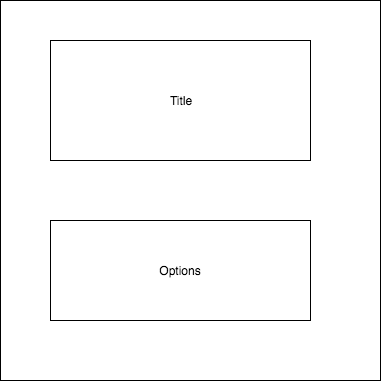
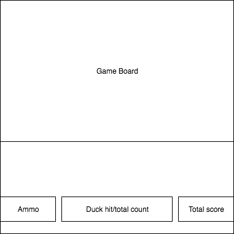

# Ducks Hunter

### Background

Duck Hunt is a classic arcade game in which ducks fly around the map in which the player has a limited amount of ammo to shoot it down. Once shot, you have a dog to fetch you your prize.

### Minimum Viable Product

1. A loading intro screen of the game and options to begin game
2. Ability to shoot down ducks with a responsive UI along with track of bullets and score
3. Increasing difficulty, most likely with flight speed of duck for each level
4. End screen

### Technologies

JavaScript will handle the logic of the game and Easel.js library will help render the game.

### Wireframes

The application will consist of two screens, the intro screen and the gameplay screen.

Game play screen will have the ammo count, score and number of ducks hit/left.

### Implementation Timeline

#### Phase 1
1. Understanding Easel.js library and complete rendering of game board and loading screen.

2. Complete logic for ducks movement and rendering on game board.

#### Phase 2

1. Complete logic for shooting down duck and update ammo, ducks killed/left, score.

2. Style game accordingly and test for bugs.

#### Phase 3

1. Complete loading intro screen and game ending screen.
